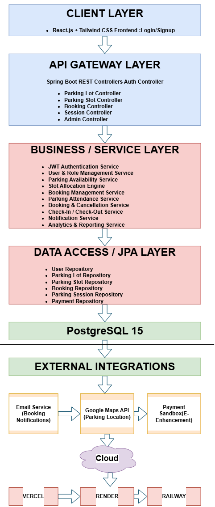

Smart Parking & Slot Booking Platform is a full-stack web application designed to streamline parking management through real-time slot availability tracking, online parking reservations, and vehicle check-in/check-out operations. The system includes secure JWT-based authentication, role-based access control for drivers, attendants, and administrators, automated slot allocation with concurrency handling to prevent double-booking, booking history management, occupancy analytics, and a responsive user interface for both desktop and mobile users. Built with React.js, Spring Boot, and PostgreSQL, the platform follows a modular REST API architecture and is designed for scalable cloud deployment and efficient parking operations.
## Architecture Diagram

Editable source file:

docs/architecture-diagram.drawio

---

## ER Diagram

---

## Mandatory Files

- .gitignore
- LICENSE
- .env.example
- CHANGELOG.md